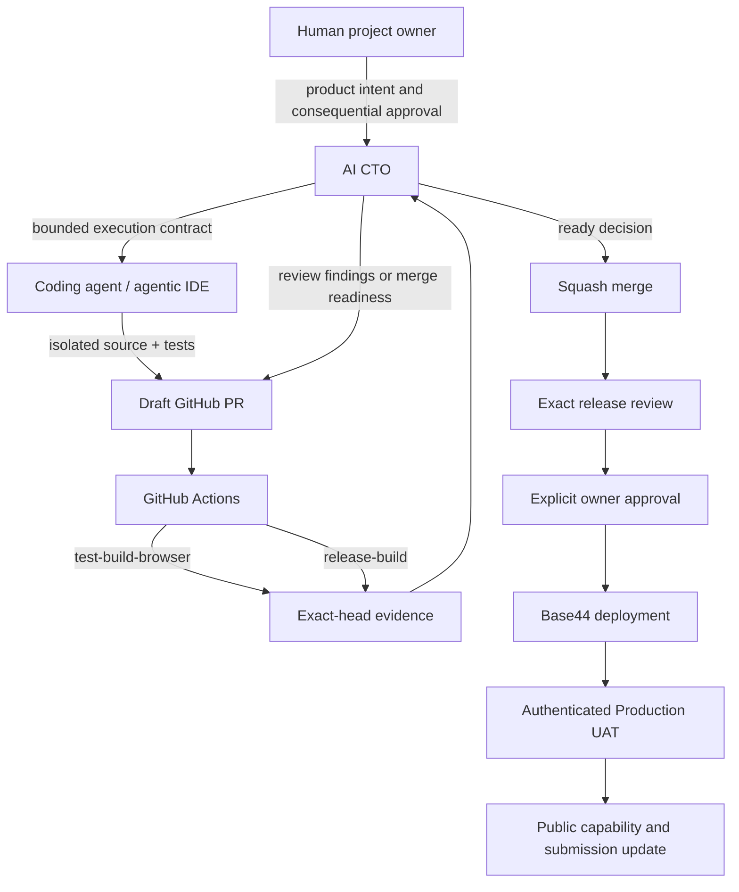

# Agentic Development Method — Resonance / WatchTree

WatchTree was not produced by a single model generating a finished application. It was built through a role-defined development system in which human approval, AI-assisted review, isolated coding agents, GitHub evidence, and Base44 runtime authority remained separate.

## Responsibility model

### 1. Human project owner

The human project owner defined product intent and retained final authority over consequential decisions:

- product direction and trust boundaries;
- acceptance of scope tradeoffs;
- merge approval where required;
- Production deployment;
- public submission and capability claims.

The owner could delegate implementation and review work, but not responsibility for the final release.

### 2. AI CTO

The AI CTO converted product intent into explicit execution contracts and reviewed exact remote evidence:

- known base and expected head SHAs;
- allowed and forbidden file scopes;
- security and privacy constraints;
- acceptance tests and browser journeys;
- review findings and correction prompts;
- merge-readiness decisions;
- separation of source, Production, roadmap, and unused capabilities.

The AI CTO did not treat a worker’s completion report as proof. Source, diff, PR state, and CI were checked independently before merge.

### 3. Coding agents and agentic IDEs

Implementation agents worked on isolated branches or worktrees with bounded contracts. A typical contract specified:

- the exact repository and branch;
- the starting SHA;
- the files that could change;
- prohibited changes such as RLS weakening, service-role access, new dependencies, or Production deployment;
- focused and full validation commands;
- the required Draft PR body and evidence.

Coding agents did not receive Production passwords, OTPs, cookies, Base44 secret values, or unrestricted dashboard access.

### 4. GitHub and CI

GitHub was the public version-control, review, and evidence boundary:

- every product change entered through a PR;
- Draft status was maintained until exact-head review and green CI;
- PR bodies recorded exact base/head references and validation results;
- review findings were preserved publicly;
- corrections produced new commits and fresh CI rather than unverifiable local claims;
- superseded work was closed with an explanation rather than silently discarded.

The two primary CI jobs are:

1. `test-build-browser` — shared-source parity, deterministic tests, Vite build, and browser validation.
2. `release-build` — fail-closed Production App-ID verification, release build, and bundle-content assertions.

**CI does not deploy.**

### 5. Base44 runtime authority

Base44 remained authoritative for:

- Auth and caller identity;
- owner-scoped Entity storage and `created_by_id` RLS;
- caller-scoped Deno Function execution;
- backend secret provisioning;
- Realtime-capable Entity resources;
- public hosting and deployment.

No separate database, Auth provider, permission middleware, API server, or service-role matching system was introduced.

## Development and release flow

## Why the contracts were strict

Agentic implementation is most useful when the agent’s freedom is bounded by product and security rules.

Examples:

| Allowed | Forbidden |
| --- | --- |
| Add a deliberate URL collection path | Automatically read a YouTube account |
| Store bounded user-provided labels with provenance | Present those labels as verified platform metadata |
| Match against versioned synthetic archetypes | Scan other users or imply a real-person match |
| Add caller-scoped Realtime restore | Mutate Entity or Function state from a Realtime callback |
| Add tutorial presentation state | Duplicate matching, consent, mutual, or deletion logic in the browser |
| Document an Agent roadmap | Claim a runtime Agent was used when it was not |

The written contract was intentionally narrower than what the code or platform could technically do.

## Review-driven corrections

Public review history records material failures rather than hiding them. Examples include:

- invalid initial Base44 Function entrypoint assumptions;
- reveal-consent token namespace mismatch;
- deletion ordering and interrupted-resume risks;
- unsupported creator and duration evidence in no-key matching;
- Realtime session and late-subscription races;
- tutorial mount, reducer/action, delete-loop, replay, and localization failures;
- stale PR bodies and source-versus-Production wording.

Each accepted correction required a committed fix and fresh exact-head CI.

## Current verification baseline

At the latest reviewed source (`4efc2827bf9fae2ad99602090c2621845b7c89a3`):

- 13 Entity schemas;
- 13 Deno Function sources;
- 314 deterministic tests;
- 11 browser scenarios;
- desktop, mobile, reduced-motion, and Korean tutorial coverage;
- release build and bundle-boundary checks;
- no runtime AI matching, service role, cross-user scan, external metadata API, or Base44 File storage.

Realtime and the judge tutorial are merged in source but remain Production-ineligible until the exact release is deployed and authenticated UAT is complete.

## Parallel development rule

Parallel work was permitted only with disjoint file ownership. Product source, submission documentation, and video-production packages used separate branches and scopes. Shared backend modules were synchronized from canonical sources by repository scripts rather than edited independently in every Function directory.

This reduced merge conflicts and made each PR reviewable as a bounded change.

## Public repository hygiene

Because the repository and PR history are part of the submission:

- README language must be understandable without internal project context;
- old counts remain historical, not “current” claims;
- current source and deployed runtime are separated explicitly;
- superseded PRs are closed with replacement links and reasons;
- secret names may appear only as safe architecture labels, never with values;
- roadmap ideas are not presented as implemented integrations;
- video scripts and upload records remain provisional until final release evidence exists.

## Repository evidence

| Evidence | Location |
| --- | --- |
| Core product baseline | PR #4 and PR #25 |
| Reveal-consent correction | PR #27 |
| Release CI | PR #32 |
| Privacy lifecycle | PR #36 |
| URL collection and grounded matching | PR #37 |
| Public build journal and platform narrative | PR #44 |
| Realtime source | PR #45 |
| Judge tutorial and localization corrections | PR #47 |
| Deterministic tests | `tests/*.test.mjs` |
| Browser validation | `tests/browser/run-watchtree.mjs` |
| Release verification | `scripts/verify-release-bundle.mjs` |
| Shared Function parity | `scripts/sync-base44-function-shared.mjs`, `scripts/check-base44-function-shared.mjs` |

## Tools and roles

| Tool | Role |
| --- | --- |
| Base44 | Auth, Entities/RLS, Deno Functions, secrets, Realtime-capable resources, hosting, deployment |
| GitHub | Issues, PRs, review history, CI, evidence artifacts |
| Git worktrees / isolated clones | Parallel file ownership and branch isolation |
| Coding models | Contract-bounded implementation and correction |
| AI CTO | Execution contracts, independent review, source/Production truth boundary |
| Vite | Frontend and release build tooling |
| Playwright | Browser journey and error-boundary validation |
| Node test runner | Deterministic unit and integration verification |

The core claim is therefore precise: **external agentic development implemented WatchTree against Base44’s SDK and data contracts, while Base44 remained the authoritative production backend and the human project owner retained final release authority.**
