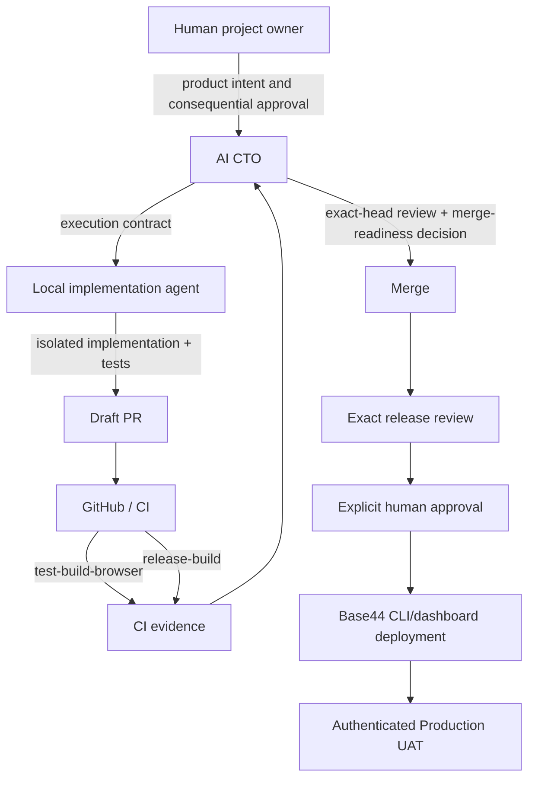

# Agentic Development Method — Resonance / 공명

How external agentic coding and Base44 worked together to build WatchTree.

---

## The working model

WatchTree was not built by a single AI generating a complete application. It was built by a **multi-agent system with role-defined contracts**, where Base44 served as the authoritative backend platform and GitHub was the evidence and integration boundary.

### Layer 1: Product intent and contract (human project owner + AI CTO)

A human project owner defined product intent and held final approval authority. An AI CTO defined execution contracts, performed source review, verified exact-head SHAs, and made merge-readiness decisions. Together they specified:

- **Product requirements:** What the feature should do, in what order, and what it must not do. Written as GitHub Issues with acceptance criteria, forbidden behaviors, and priority labels.
- **Security boundaries:** Exact SHA baselines, allowed and forbidden file changes, contract regexes that entrypoint code must match (and must not match), and explicit prohibitions (no service role, no other-user scan, no runtime AI).
- **Review checklists:** Each PR was reviewed against a written checklist. AI CTO review findings were tracked as PR comments and resolved before merge.

### Layer 2: Local model + agentic IDE (implementation)

A local language model (running outside Base44's infrastructure) and an agentic IDE implemented isolated source slices. Each implementation session had:

- A defined **file scope** (e.g., "only `src/watchtree/` and `tests/`")
- A known **base commit** (e.g., "start from `a4975906`")
- An explicit **allowed/changed forbidden list** (e.g., "you may modify `src/watchtree/matching.js` and `src/watchtree/fixtures.js`; you may NOT modify Auth/RLS, add dependencies, or change the CI pipeline")
- CI feedback from the **previous attempt** (if any)

The agent never accessed:
- The Base44 dashboard or console
- Production secrets or environment variables
- The deployment pipeline
- Other users' data or account information

### Layer 3: GitHub integration and evidence

GitHub served as the source-of-truth integration boundary and auditable evidence record:

- **Draft PR** state was maintained until exact-head CI and AI CTO review passed.
- **Exact base/head SHA** tracking: every review referenced the precise commit under review.
- **Review comments** were tracked as PR comments and resolved before merge.
- **CI** ran test-build-browser and release-build on each push, producing auditable pass/fail evidence.
- **Auditable correction history**: every CTO finding linked to a fix commit; no correction was accepted without CI re-run.

### Layer 4: Validation and release governance

The current release workflow runs two CI jobs:

1. **test-build-browser**: deterministic tests + browser validation + Vite build
2. **release-build**: fail-closed verification + production build + bundle content assertion

The current final-source suite contains 277 deterministic tests. Test coverage and counts evolved during development.

An AI CTO reviewed the exact source and CI evidence, while the human project owner retained final approval for consequential merge, deployment, and submission decisions. **No model-produced output was trusted without both CI pass and AI CTO review.**

---

## Development and release flow

**CI does not deploy.** Deployment occurs only after merge, exact release review, and explicit human project-owner approval.

---

## Key principles

### 1. Base44 is the runtime authority

The agent never deployed, never mutated secrets, never accessed the Base44 dashboard, and never called production APIs directly. Base44 remained the single authority for:
- Authentication and caller identity
- Entity storage and RLS enforcement
- Deno function execution
- Secrets provision (the `WATCHTREE_HMAC_KEY` was set via the Base44 console, not in code)
- Hosting and deployment

### 2. No model output is trusted without CI and code review

Current reviewed submission slices are verified by:
- **Deterministic tests** (277 in the current final-source suite) that must pass
- **Browser validation** that screenshots every UI state and asserts no console errors, page errors, or unexpected external requests
- **Release build verification** that checks production App ID presence and forbidden string absence
- **AI CTO review** with human project-owner approval, checking contract regexes, exact SHA baselines, and PR body accuracy

### 3. Parallel work uses disjoint file ownership

Multiple agents could work simultaneously because:
- Each issue defined a non-overlapping file scope (e.g., Issue #29 = `base44/functions/_shared/watchtree.js` + `src/watchtree/`; Issue #33 = `base44/functions/add-watch-url-event/` + `src/watchtree/`)
- Shared modules were managed by a vendoring script (`sync-base44-function-shared.mjs`) that copied canonical sources to all function directories
- Each branch was in a separate git worktree, avoiding in-flight merge conflicts

### 4. The contract is stricter than the implementation

The written contract (Issue body + CTO review comments) was always more restrictive than what the code could technically do. For example:
- **Allowed:** Add `url_collection` to existing enum
- **Forbidden:** Create new Entities, weaken RLS, add service role
- **Allowed:** Parse URL and store video ID
- **Forbidden:** Fetch YouTube API, use API key, scrape page

This asymmetry was deliberate: the contract constrained the agent from capabilities that were technically possible but product-wise wrong.

### 5. Failures are recorded, not hidden

Every CTO review finding was documented in the PR body and linked to a fix commit. The build journal records each failure, its correction, and the verification evidence. No correction was accepted without CI re-run.

---

## Repository evidence

| Artifact | Location |
|----------|----------|
| PR history with CTO reviews | PR #32, #36, #37 on GitHub |
| Contract specifications | Issues #1, #20, #29, #30, #33 |
| CI results | GitHub Actions (release-build + test-build-browser) |
| Deterministic tests | `tests/*.test.mjs` (277 tests) |
| Browser validation | `tests/browser/run-watchtree.mjs` |
| Release bundle verification | `scripts/verify-release-bundle.mjs` |
| Shared module parity | `scripts/sync-base44-function-shared.mjs`, `scripts/check-base44-function-shared.mjs` |
| Function boundary test | `tests/base44-function-bundle-boundary.test.mjs` |

---

## Tools used

| Tool | Role |
|------|------|
| **Base44** | Auth, Entities, RLS, Deno Functions, secrets, hosting |
| **GitHub** | Issues, PRs, code review, CI (Actions), artifact storage |
| **Git worktrees** | Parallel development isolation |
| **Local LLM** | Code generation under human-defined contract |
| **Agentic IDE** | File editing, git operations, shell execution |
| **Vite** | Frontend build tooling |
| **Playwright** | Browser validation |
| **Node test runner** | Deterministic unit/integration tests |
